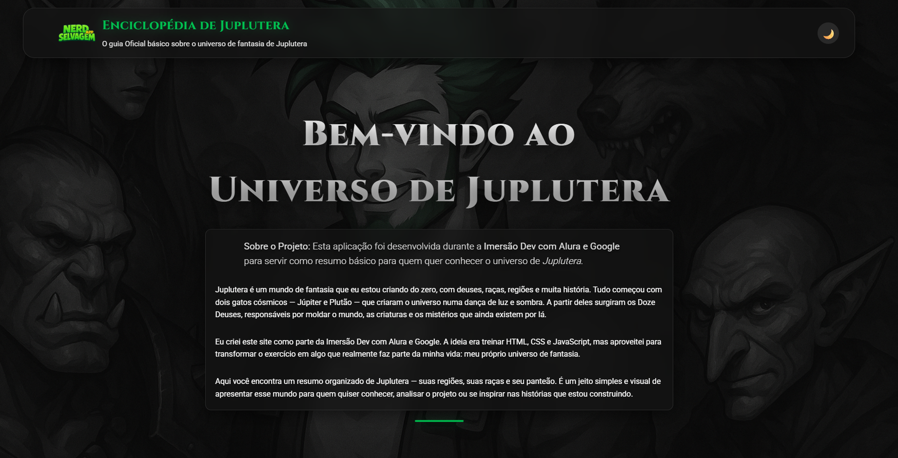
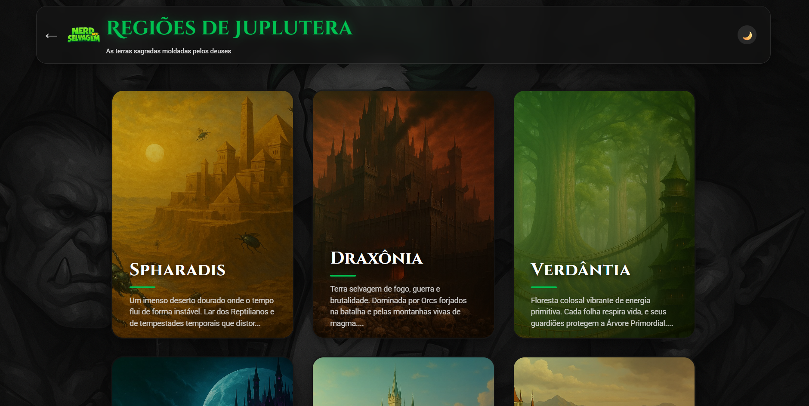
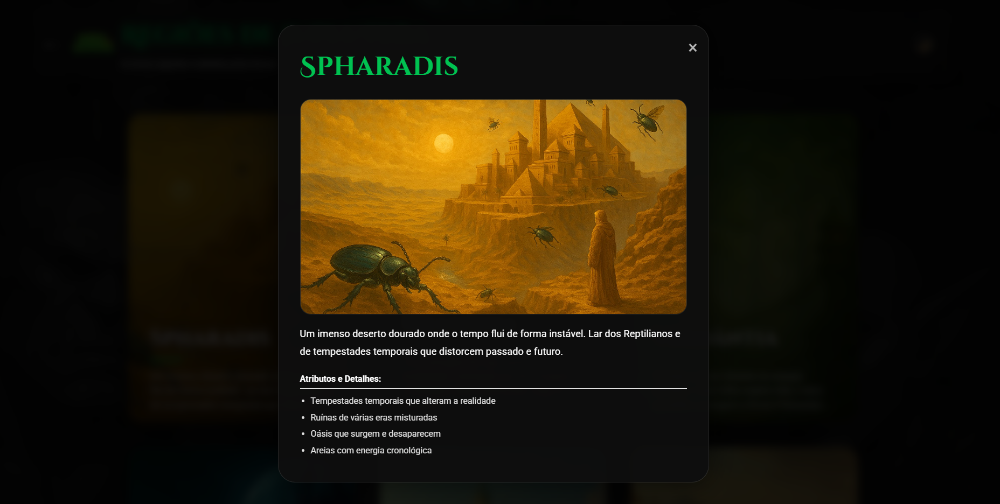
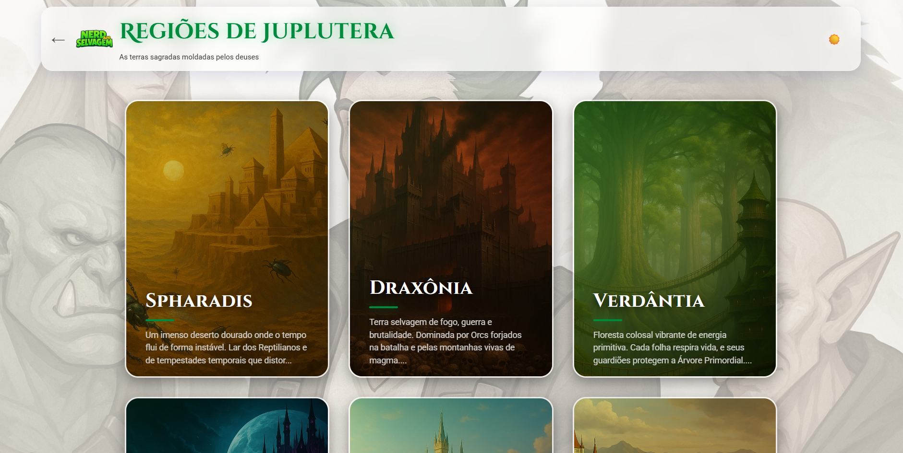

# 🪐 Enciclopédia de Juplutera  
**Imersão Dev com Alura + Google – Novembro 2025**

> **Estou participando da seleção dos melhores projetos da Imersão Dev com Alura e Google.**

🔗 **Acesse o projeto ao vivo:** https://tiorael.github.io/juplutera-enciclopedia

---

## 🚀 Sobre o Projeto

**Juplutera** é meu universo de fantasia 100% original — criado do zero com deuses cósmicos, raças únicas, regiões vivas e uma mitologia rica.  
Essa enciclopédia interativa é o **guia oficial básico** desse mundo, perfeito para quem quer conhecer a lore e adentrar no universo.

Desenvolvido **na mão** durante a **Imersão Dev com Alura + Google (Nov/2025)**, usando apenas:

- HTML5 semântico  
- CSS3 avançado (Grid, Flexbox, variáveis, glassmorphism, animações  
- JavaScript puro (ES6+)async/await, fetch, modal dinâmico, localStorage  
- JSON como “banco de dados” local  
- IA Gemini para auxilio e refinamento dos códigos

Zero frameworks · Zero bibliotecas externas · 100% dentro do que foi ensinado ♡

---

## 🎮 Como Explorar

1. Na home, escolha **Regiões**, **Raças** ou **Deuses**  
2. Clique em qualquer card → abre um modal com algumas informações  
3. Use 🌙 / ☀️ no canto superior direito para trocar de tema (sua escolha fica salva)  
4. Feche o modal com X, clique fora ou tecla **ESC**

---

## ✨ Funcionalidades Implementadas

- Tema claro/escuro com persistência (`localStorage`) 🌒
- Carregamento dinâmico de JSON via `fetch()`
- Cards com hover glow e modal detalhado
- Totalmente responsivo (mobile-first)
- Glassmorphism + efeitos de luz épicos
- Acessibilidade (navegação por teclado + ARIA)
- Imagens com `loading="lazy"`

---

## 🗂️ Estrutura do Projeto

juplutera-enciclopedia/

├── index.html

├── estilos.css

├── script.js

├── dados/

│   ├── deuses.json

│   ├── racas.json

│   └── regioes.json

├── assets/imagens/

├── paginas/

│   ├── deuses.html

│   ├── racas.html

│   ├── regioes.html

│   └── sobre.html

└── README.md

---

## 🎨 Galeria de Telas

| Home – Tema Escuro                  | Modal Detalhado                       | Tema Claro                          |
|-------------------------------------|---------------------------------------|-------------------------------------|
|  |  |  |

---

## 🛠️ Tecnologias Utilizadas (Vanilla Only)

| Tecnologia      | Uso                                      |
|-----------------|------------------------------------------|
| HTML5           | Estrutura semântica e acessível          |
| CSS3            | Design completo, temas, animações        |
| JavaScript ES6+ | Lógica, fetch, modal, tema dinâmico      |
| JSON            | Armazenamento da lore                    |
| GitHub Pages    | Deploy gratuito                          |

---

## 💡 Por que esse projeto é especial?

Porque ele não é só um exercício — é **parte real da minha vida**.  
Juplutera é um universo que estou construindo há 2 anos.  
A Imersão Dev foi a chance perfeita de aprimorar meus conhecimentos, aprendendo do jeito certo: codando cada linha, entendendo cada conceito, e usando a IA apenas como aliada.

O resultado é algo que eu mostro com orgulho pra qualquer pessoa. E agora está aqui pra vocês também ♡

---

## 👨‍💻 Autor

   
  <b>Israel Menezes</b>

**Israel Menezes**  
aka **Nerd Selvagem** – Criador de mundos & Dev em formação 🔥

- Site pessoal: [nerdselvagem.com.br](https://www.nerdselvagem.com.br)

> Projeto feito com muito carinho na **Imersão Dev com Alura + Google – Novembro 2025**

---

⭐ **Se curtiu, deixa uma estrela no repositório!**  
Isso ajuda demais na avaliação da Imersão e me deixa extremamente feliz! 🚀🪐

Obrigado por visitar Juplutera. Que os gatos cósmicos guiem sua jornada.
